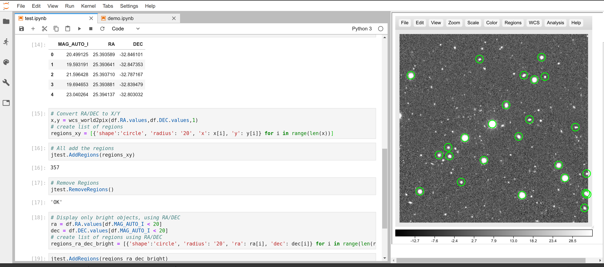

## JJS9

This is a small and *in development* wrapper for a front-end [JS9](https://github.com/ericmandel/js9) application which is a astronomical image display tool written in Javascript based on DS9. It is a **server extension** for Jupyter Lab which runs the node server and add extra handlers to the running Lab.

It can be used to create *any number* of JS9 Displays windows running from the server via socket.io communication. The node server and the small python server are loaded when the notebook start.

Create as many instances needed and display a JS9 windows and functionalities. There has been some recent work to make sure it works under Jupyter Labs which doesn't support loading Javascript directly. For old version see [here](old_version/).

### Installation

There is a lot of requirements, including node.js and enabling ipywidgets. Here you can use conda to get started:

```
conda create -n jjs9 -y python=3
## need to activate
conda install -y -c conda-forge nodejs ipywidgets
conda install -y jupyterlab tornado astropy
pip install sidecar
pip install git+https://github.com/ericmandel/pyjs9.git
pip install "python-socketio[client]"
pip install socketIO-client
```

To enable the jupyter widgets:
```
jupyter labextension install @jupyter-widgets/jupyterlab-manager
jupyter labextension install @jupyter-widgets/jupyterlab-sidecar
```

And finally to install jjs9:

```
git clone https://github.com/mgckind/jjs9.git
cd jjs9
pip install -e .
```

Now to enable the jjs9 server to run alongside the Jupyter Lab,

    jupyter-lab --NotebookApp.nbserver_extensions="{'js9server.js9ext':True}"

### Example
See [demo.ipynb](demo.ipynb) for a quick and brief demo

